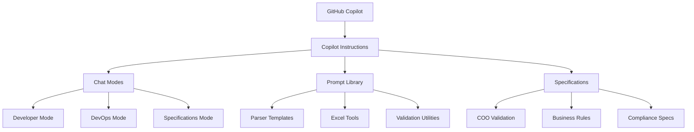

# GitHub Copilot Integration for Trade ExportsCore PLP

## Executive Summary

The Trade ExportsCore Packing List Parser (PLP) project leverages advanced GitHub Copilot integration to accelerate development, ensure consistent code quality, and reduce onboarding time from weeks to days. This AI-powered development environment provides role-specific assistants, automated quality gates, and comprehensive prompt libraries that align with DEFRA's regulatory requirements and technical standards.

## Architecture Overview

The GitHub Copilot integration consists of four main components working together to provide intelligent development assistance:



### MCP Server Integration

The system integrates with multiple Model Context Protocol (MCP) servers for enhanced capabilities:

- **Sequential Thinking MCP**: Complex problem-solving and architecture planning
- **GitHub MCP**: Repository operations, PR management, code reviews
- **Azure DevOps MCP**: Work item lifecycle, batch operations, hierarchy management
- **Context7 MCP**: Library documentation and current best practices
- **SonarQube MCP**: Code quality analysis and technical debt assessment

## Features & Capabilities

### Intelligent Development Assistance

- **Context-Aware Code Generation**: Understands project patterns, conventions, and requirements
- **Automated Testing**: Generates comprehensive test suites with edge cases and mocks
- **Documentation Generation**: Creates technical documentation aligned with project standards
- **Code Review Automation**: Provides detailed reviews with compliance checking

### Role-Specific AI Assistants

- **[Developer Mode](chatmodes/README.md#developer-mode)**: Parser creation, testing, debugging
- **[DevOps Mode](chatmodes/README.md#devops-mode)**: Pipeline management, deployment, monitoring
- **[Specifications Mode](chatmodes/README.md#specifications-mode)**: Requirements analysis, validation specs

### Comprehensive Prompt Library

- **[Parser Templates](prompts/README.md#parser-templates)**: Standardized parser creation workflows
- **[Excel Tools](prompts/README.md#excel-tools)**: Bulk operations and validation utilities
- **[Validation Utilities](prompts/README.md#validation-utilities)**: Compliance and quality checking

## Technical Implementation

### Core Configuration

The integration is configured through [`copilot-instructions.md`](copilot-instructions.md), which provides:

- **Project Context**: Architecture patterns, technology stack, dependencies
- **Development Standards**: Coding conventions, testing requirements, quality gates
- **Business Rules**: DEFRA regulations, compliance requirements, validation logic
- **Tool Integration**: MCP server configurations and usage patterns

### Chat Mode Architecture

Each chat mode extends the base configuration with role-specific instructions:

```yaml
Base Instructions (copilot-instructions.md)
├── Project Overview & Architecture
├── Core Development Patterns
├── MCP Server Integration
└── Common Utilities

Role-Specific Extensions
├── Developer.chatmode.md → Parser Development Focus
├── DevOps.chatmode.md → Pipeline & Deployment Focus
└── Specifications.chatmode.md → Requirements & Validation Focus
```

### Prompt Engineering Framework

Prompts are organized hierarchically with versioning and reusability:

```
prompts/
├── excel/           # Excel processing utilities
├── parsers/         # Parser development templates
├── spec/            # Specification management
└── utilities/       # Common development tools
```

### Quality Assurance Integration

- **Pre-commit Gates**: Automated formatting, testing, and validation
- **SonarQube Analysis**: Continuous code quality monitoring (when available)
- **Compliance Checking**: DEFRA regulatory requirement validation
- **Documentation Sync**: Automated spec-to-implementation alignment

## Usage Guidelines

### Getting Started

1. **Select Appropriate Chat Mode**: Choose based on your role and task type
2. **Reference Prompt Library**: Use existing prompts for common tasks
3. **Follow Quality Gates**: Ensure all checks pass before committing
4. **Update Specifications**: Keep COO specs aligned with implementation

### Best Practices

- **Context First**: Always provide sufficient context for AI assistance
- **Iterative Refinement**: Use feedback loops to improve generated code
- **Validation Required**: Review and test all AI-generated code
- **Documentation Updates**: Keep specs and documentation current

### Development Workflow Integration

```bash
# Standard development with AI assistance
1. Select chat mode based on task
2. Use prompts for code generation
3. Apply automated quality gates
4. Validate against specifications
5. Commit with compliance checking
```

## Maintenance & Governance

### Regular Updates

- **Monthly Review**: Assess prompt effectiveness and update based on usage patterns
- **Quarterly Architecture Review**: Evaluate MCP server integration and performance
- **Specification Alignment**: Ensure COO specs remain current with regulatory changes
- **Knowledge Base Expansion**: Add new patterns and learnings to prompt library

### Performance Metrics

- **Code Generation Accuracy**: Track success rate of generated code
- **Development Velocity**: Measure time-to-completion improvements
- **Quality Metrics**: Monitor test coverage, defect rates, and technical debt
- **User Satisfaction**: Regular feedback collection from development teams

### Compliance & Security

- **Regulatory Alignment**: Ensure AI assistance complies with DEFRA requirements
- **Code Review Standards**: Maintain human oversight of all AI-generated code
- **Data Privacy**: Protect sensitive information in prompts and specifications
- **Version Control**: Track all changes to prompts and specifications

## Related Documentation

- **[Chat Modes](chatmodes/README.md)**: Role-specific AI assistants and usage patterns
- **[Prompt Library](prompts/README.md)**: Reusable templates and code generation tools
- **[COO Specifications](coo/README.md)**: Country of Origin validation requirements
- **[Project Overview](../README.md)**: Main project documentation and setup

## Support & Contributing

### Getting Help

- **Technical Issues**: Use Developer chat mode for debugging assistance
- **Process Questions**: Use DevOps chat mode for workflow guidance
- **Requirements Clarification**: Use Specifications chat mode for business rules

### Contributing to the AI System

- **Prompt Improvements**: Submit PR with updated prompts based on learnings
- **Specification Updates**: Keep COO specs current with regulatory changes
- **Pattern Documentation**: Add new development patterns to instruction base
- **Metrics Reporting**: Share performance improvements and success stories

---

**Last Updated**: September 2025  
**Version**: 2.0  
**Maintainer**: DEFRA ExportsCore Team
