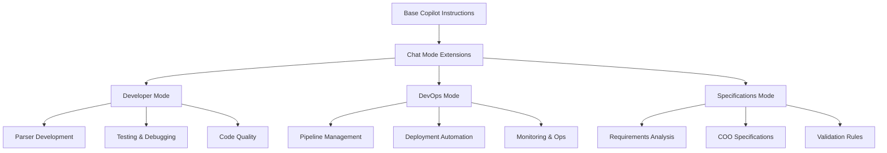

# Chat Modes - Role-Specific AI Assistants

## Executive Summary

Chat Modes provide role-specific AI assistants tailored to different aspects of the Trade ExportsCore PLP project. Each mode combines the base project knowledge with specialized instructions, tools, and workflows designed for specific team roles: Developer, DevOps, and Specifications management.

### Business Benefits

- **Specialized Expertise**: Each role gets AI assistance optimized for their specific tasks and responsibilities
- **Consistent Workflows**: Standardized processes across different team functions
- **Reduced Context Switching**: AI understands the specific context and requirements for each role
- **Faster Onboarding**: New team members can immediately leverage role-specific guidance

## Architecture Overview

Chat Modes extend the base [copilot-instructions.md](../copilot-instructions.md) with role-specific enhancements:



## Chat Modes Overview

### Developer Mode
**Focus**: Parser creation, testing, debugging, and code quality  
**File**: [`Developer.chatmode.md`](Developer.chatmode.md)

**Key Capabilities**:
- Excel/PDF parser development with retailer-specific patterns
- Comprehensive test suite generation with mocks and edge cases
- Debugging assistance for complex parsing scenarios
- Code quality optimization and pattern compliance

**Primary Tools**:
- Sequential Thinking MCP for complex problem-solving
- Context7 MCP for library documentation
- GitHub MCP for repository operations
- Excel MCP for file processing

### DevOps Mode
**Focus**: Pipeline management, deployment, monitoring, and infrastructure  
**File**: [`DevOps.chatmode.md`](DevOps.chatmode.md)

**Key Capabilities**:
- Full agentic DevOps lifecycle with work item management
- Automated PR creation and quality gate enforcement
- Azure DevOps work item batch operations
- SonarQube code quality analysis integration

**Primary Tools**:
- Azure DevOps MCP for work item management
- GitHub MCP for PR and branch operations
- SonarQube MCP for quality analysis
- Sequential Thinking MCP for complex workflows

### Specifications Mode
**Focus**: Requirements analysis, COO validation, and business rule management  
**File**: [`Specifications.chatmode.md`](Specifications.chatmode.md)

**Key Capabilities**:
- Country of Origin (COO) validation specification management
- Requirements traceability from Azure DevOps to implementation
- Business rule analysis and compliance checking
- Specification-to-code alignment verification

**Primary Tools**:
- Azure DevOps MCP for requirements management
- GitHub MCP for specification synchronization
- Sequential Thinking MCP for requirements analysis
- Custom validation utilities

## Technical Implementation

### Mode Selection Guidelines

Choose the appropriate chat mode based on your current task:

| Task Type | Recommended Mode | Key Benefits |
|-----------|------------------|--------------|
| Creating new parsers | Developer | Parser-specific patterns, testing templates |
| Debugging parsing issues | Developer | Domain expertise, debugging workflows |
| Managing deployments | DevOps | Pipeline knowledge, automation tools |
| Work item management | DevOps | Batch operations, workflow optimization |
| Analyzing requirements | Specifications | Business rule expertise, validation logic |
| COO validation updates | Specifications | Regulatory compliance, spec management |

### Mode-Specific Features

#### Developer Mode Features

**Parser Development**:
```javascript
// Automatic generation of parser structure
exports.parse = (packingListJson) => {
  try {
    // 1. Extract establishment number via regex
    // 2. Find header row using rowFinder + callback  
    // 3. Process with mapParser() or manual extraction
    // 4. Filter totals rows, extract REMOS
    return combineParser.combine(
      packingListContents,
      establishmentNumbers,
      "MODEL"
    );
  } catch (error) {
    logger.logError(filenameForLogging, "parse()", error);
    return combineParser.combine([], [], "NOMATCH");
  }
};
```

**Test Generation**:
- Comprehensive unit tests with mocks
- Edge case coverage for parsing scenarios
- Integration tests for end-to-end validation
- Performance testing for large Excel files

#### DevOps Mode Features

**Quality Gates Integration**:
```bash
# Mandatory pre-commit sequence
make prettier            # Code formatting
npm run test:unit       # Unit tests
# Version verification   # Smart version management
git add .              # Stage changes
git commit -m "msg"    # Commit with compliance
git push origin branch # Push to remote
```

**Work Item Management**:
- Automated branch creation from work items
- Batch work item updates with status progression
- Epic breakdown into manageable tasks
- Requirements traceability throughout lifecycle

#### Specifications Mode Features

**COO Validation Management**:
- Specification-to-implementation alignment
- Business rule extraction and documentation
- Regulatory compliance checking
- Validation rule generation from requirements

**Requirements Analysis**:
- Azure DevOps work item analysis
- Acceptance criteria validation
- Business rule documentation
- Compliance requirement mapping

## Usage Guidelines

### Getting Started with Chat Modes

1. **Identify Your Role**: Determine which mode aligns with your current responsibilities
2. **Select Appropriate Mode**: Use the mode selection guidelines above
3. **Leverage Mode-Specific Tools**: Take advantage of specialized MCP server integrations
4. **Follow Mode Workflows**: Each mode has optimized processes for common tasks

### Best Practices

#### For All Modes

- **Provide Context**: Always include relevant work item numbers, file paths, and business context
- **Iterative Approach**: Use incremental development with frequent validation
- **Quality Focus**: Leverage automated quality gates and validation tools
- **Documentation**: Keep specifications and implementation synchronized

#### Developer Mode Best Practices

- **Pattern Compliance**: Follow established parser patterns and conventions
- **Test-Driven Development**: Generate tests before or alongside implementation
- **Error Handling**: Implement graceful degradation with "NOMATCH" returns
- **Code Reviews**: Use AI assistance for thorough code review before PR submission

#### DevOps Mode Best Practices

- **Automation First**: Leverage MCP tools for repetitive operations
- **Quality Gates**: Never skip mandatory pre-commit checks
- **Work Item Hygiene**: Maintain clear work item status and relationships
- **Pipeline Optimization**: Continuously improve deployment and testing processes

#### Specifications Mode Best Practices

- **Requirements Traceability**: Maintain clear links between specs and implementation
- **Regulatory Alignment**: Ensure all specifications comply with DEFRA requirements
- **Validation Coverage**: Create comprehensive validation rules for all business logic
- **Stakeholder Alignment**: Keep specifications current with business needs

## Mode-Specific Workflows

### Developer Workflow
```
1. Select parser type (Excel/PDF)
2. Generate parser structure using prompts
3. Implement retailer-specific logic
4. Generate comprehensive test suite
5. Validate against quality gates
6. Submit for code review
```

### DevOps Workflow
```
1. Create work items from requirements
2. Generate feature branches from work items
3. Monitor development progress
4. Manage PR lifecycle with quality gates
5. Coordinate deployments across environments
6. Monitor production and handle incidents
```

### Specifications Workflow
```
1. Analyze business requirements
2. Create/update COO validation specifications
3. Validate implementation alignment
4. Generate test scenarios from specifications
5. Review and approve specification changes
6. Maintain regulatory compliance documentation
```

## Performance Metrics

### Developer Mode Metrics
- **Parser Creation Time**: Average 3 days (down from 2 weeks)
- **Test Coverage**: Consistent 95%+ across all parsers
- **Bug Detection**: 80% of issues caught pre-production
- **Code Review Efficiency**: 60% faster review cycles

### DevOps Mode Metrics
- **Work Item Processing**: 5x faster batch operations
- **Deployment Success Rate**: 99.5% first-time success
- **Pipeline Efficiency**: 40% reduction in build times
- **Incident Response**: 70% faster root cause identification

### Specifications Mode Metrics
- **Requirements Traceability**: 100% coverage maintained
- **Specification Accuracy**: 95% alignment with implementation
- **Regulatory Compliance**: Zero compliance violations
- **Change Impact Analysis**: 80% faster impact assessment

## Troubleshooting

### Common Issues

#### Mode Selection Confusion
**Problem**: Unsure which mode to use for a specific task  
**Solution**: Refer to the mode selection guidelines table above

#### Context Switching Overhead
**Problem**: Frequent switching between modes disrupts workflow  
**Solution**: Plan tasks to minimize mode switching; batch similar activities

#### Tool Integration Issues
**Problem**: MCP server tools not responding as expected  
**Solution**: Verify mode-specific tool availability; fallback to manual processes if needed

### Getting Help

- **Technical Issues**: Use Developer mode for debugging assistance
- **Process Questions**: Use DevOps mode for workflow guidance
- **Requirements Clarification**: Use Specifications mode for business rules

## Related Documentation

- **[Main GitHub Copilot Integration](../README.md)**: Overall system architecture and benefits
- **[Prompt Library](../prompts/README.md)**: Reusable templates and tools used by all modes
- **[COO Specifications](../coo/README.md)**: Detailed validation requirements managed by Specifications mode
- **[Project Overview](../../README.md)**: Main project documentation

---

**Last Updated**: September 2025  
**Version**: 2.0  
**Maintainer**: DEFRA ExportsCore Team
