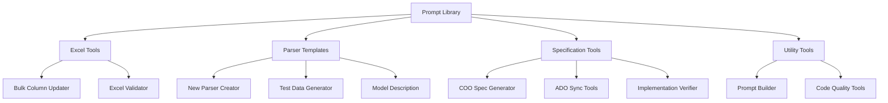

# Prompt Library - Reusable AI Templates and Tools

## Executive Summary

The Prompt Library provides a comprehensive collection of reusable AI templates, code generation tools, and validation utilities for the Trade ExportsCore PLP project. These prompts accelerate development, ensure consistency, and reduce the time required for common development tasks from hours to minutes.

## Architecture Overview

The Prompt Library is organized into specialized categories, each serving specific development needs:



## Prompt Categories

### Excel Tools
**Location**: [`excel/`](excel/)  
**Purpose**: Excel file processing, validation, and bulk operations

#### Available Prompts

##### Excel Bulk Column Updater
**File**: [`excel-bulk-column-updater.prompt.md`](excel/excel-bulk-column-updater.prompt.md)  
**Use Case**: Update multiple columns across Excel files efficiently  
**Benefits**: Handles complex column mappings, preserves formatting, validates data integrity

**Example Usage**:
```
Update columns in packing-lists/*.xlsx:
- Map "Product Description" → "description" 
- Map "Net Weight (kg)" → "total_net_weight_kg"
- Validate REMOS pattern compliance
```

##### Excel Validator
**File**: [`excel-validator.prompt.md`](excel/excel-validator.prompt.md)  
**Use Case**: Comprehensive Excel file validation against business rules  
**Benefits**: Automated compliance checking, error reporting, data quality assurance

**Validation Checks**:
- Header structure compliance
- Data type validation
- REMOS number format verification
- Country of Origin validation
- Weight calculation accuracy

### Parser Templates
**Location**: [`parsers/`](parsers/)  
**Purpose**: Automated parser creation, testing, and documentation

#### Available Prompts

##### New Excel Parser Creator
**File**: [`create-new-excel-parser.prompt.md`](parsers/create-new-excel-parser.prompt.md)  
**Use Case**: Generate complete parser implementations from sample files  
**Benefits**: Follows project patterns, includes comprehensive testing, handles edge cases

**Generated Components**:
- Parser implementation with error handling
- Matcher logic for retailer identification
- Header mapping configuration
- Comprehensive unit test suite
- Integration test scenarios

##### Test Data Generator
**File**: [`generate-test-data-from-sample.prompt.md`](parsers/generate-test-data-from-sample.prompt.md)  
**Use Case**: Create comprehensive test datasets from sample Excel files  
**Benefits**: Covers edge cases, validates business logic, ensures robust testing

**Specialized Test Generators**:
- [`generate-test-data-basic-tests.prompt.md`](parsers/generate-test-data-from-sample/generate-test-data-basic-tests.prompt.md): Core functionality tests
- [`generate-test-data-country-of-origin.prompt.md`](parsers/generate-test-data-from-sample/generate-test-data-country-of-origin.prompt.md): COO validation scenarios
- [`generate-test-data-net-weight.prompt.md`](parsers/generate-test-data-from-sample/generate-test-data-net-weight.prompt.md): Weight calculation tests
- [`generate-test-data-single-rms.prompt.md`](parsers/generate-test-data-from-sample/generate-test-data-single-rms.prompt.md): REMOS validation tests

##### Parser Model Description
**File**: [`parser-model-description.prompt.md`](parsers/parser-model-description.prompt.md)  
**Use Case**: Generate comprehensive documentation for parser implementations  
**Benefits**: Consistent documentation, pattern explanation, maintenance guidance

### Specification Tools
**Location**: [`spec/`](spec/)  
**Purpose**: Requirements management, specification generation, and compliance validation

#### Available Prompts

##### COO Spec Generator from ADO
**File**: [`generate-coo-spec-from-ado.prompt.md`](spec/generate-coo-spec-from-ado.prompt.md)  
**Use Case**: Convert Azure DevOps work items into detailed COO validation specifications  
**Benefits**: Maintains traceability, ensures completeness, standardizes format

##### ADO-Spec Synchronization
**File**: [`update-ado-from-coo-spec.prompt.md`](spec/update-ado-from-coo-spec.prompt.md)  
**Use Case**: Update Azure DevOps work items based on specification changes  
**Benefits**: Bidirectional sync, change tracking, stakeholder alignment

##### Spec-Implementation Comparison
**File**: [`compare-coo-spec-with-ado.prompt.md`](spec/compare-coo-spec-with-ado.prompt.md)  
**Use Case**: Identify discrepancies between specifications and ADO work items  
**Benefits**: Gap analysis, compliance verification, change impact assessment

##### Implementation Verification
**File**: [`verify-spec-implementation-from-github.prompt.md`](spec/verify-spec-implementation-from-github.prompt.md)  
**Use Case**: Validate that code implementation aligns with specifications  
**Benefits**: Automated compliance checking, gap identification, quality assurance

##### COO Overview Generator
**File**: [`update-coo-spec-overview-from-ado.prompt.md`](spec/update-coo-spec-overview-from-ado.prompt.md)  
**Use Case**: Generate high-level overview of COO specifications from work items  
**Benefits**: Executive reporting, progress tracking, scope management

### Utility Tools
**Location**: [`utilities/`](utilities/)  
**Purpose**: Development workflow enhancement and prompt management

#### Available Prompts

##### Prompt Builder
**File**: [`prompt-builder.prompt.md`](utilities/prompt-builder.prompt.md)  
**Use Case**: Create new prompts following project standards and best practices  
**Benefits**: Consistent prompt structure, reusability, maintenance guidelines

## Technical Implementation

### Prompt Structure Standards

All prompts follow a standardized structure for consistency and maintainability:

```markdown
# Prompt Title

## Context
[Background information and use case]

## Objective
[Clear statement of what the prompt should accomplish]

## Input Requirements
[Specific inputs needed for the prompt to work effectively]

## Expected Output
[Detailed description of expected results]

## Quality Criteria
[Success metrics and validation requirements]

## Examples
[Sample inputs and outputs for clarity]

## Technical Considerations
[Implementation details, constraints, limitations]
```

### Integration with Chat Modes

Prompts are designed to work seamlessly with specific chat modes:

| Prompt Category | Primary Chat Mode | Secondary Modes |
|----------------|-------------------|-----------------|
| Excel Tools | Developer | DevOps (for validation) |
| Parser Templates | Developer | Specifications (for requirements) |
| Specification Tools | Specifications | Developer (for implementation) |
| Utility Tools | All Modes | - |

### Version Control and Maintenance

- **Versioning**: All prompts are version-controlled with the main repository
- **Change Tracking**: Updates are tracked through standard Git workflows
- **Review Process**: Prompt changes follow the same review process as code
- **Usage Analytics**: Monitor prompt effectiveness and update based on feedback

## Usage Guidelines

### Getting Started

1. **Identify Your Need**: Determine which category addresses your current task
2. **Select Appropriate Prompt**: Choose the most specific prompt for your use case
3. **Prepare Required Inputs**: Gather all necessary context and data
4. **Execute with AI**: Use the prompt with GitHub Copilot Chat
5. **Validate Results**: Review and test all generated outputs

### Best Practices

#### Prompt Selection
- **Start Specific**: Use the most specific prompt available for your task
- **Combine When Needed**: Chain multiple prompts for complex workflows
- **Customize Context**: Adapt prompts with project-specific details
- **Validate Outputs**: Always review and test generated code/specifications

#### Input Preparation
- **Complete Context**: Provide all relevant information upfront
- **Sample Data**: Include representative examples when possible
- **Constraints**: Clearly state any limitations or requirements
- **Expected Format**: Specify desired output format and structure

#### Output Validation
- **Code Review**: All generated code must be reviewed and tested
- **Compliance Check**: Validate against project standards and regulations
- **Integration Testing**: Ensure generated components work with existing system
- **Documentation Update**: Update relevant documentation with changes

### Common Workflows

#### Parser Development Workflow
```
1. Use "create-new-excel-parser" prompt with sample file
2. Generate test data using "generate-test-data-from-sample"
3. Validate parser using "excel-validator" prompt
4. Document implementation using "parser-model-description"
5. Submit for review following standard process
```

#### Specification Management Workflow
```
1. Generate spec from ADO using "generate-coo-spec-from-ado"
2. Verify implementation alignment with "verify-spec-implementation-from-github"
3. Update overview using "update-coo-spec-overview-from-ado"
4. Sync changes back to ADO with "update-ado-from-coo-spec"
5. Compare final state with "compare-coo-spec-with-ado"
```

#### Excel Processing Workflow
```
1. Validate file structure using "excel-validator"
2. Apply bulk updates using "excel-bulk-column-updater"
3. Re-validate after changes
4. Generate parser if needed using parser templates
5. Create comprehensive test suite
```

## Advanced Features

### Prompt Chaining

Complex tasks can be accomplished by chaining multiple prompts:

```
Task: Create new retailer parser
├── 1. Excel validation (excel-validator)
├── 2. Parser generation (create-new-excel-parser)
├── 3. Test data creation (generate-test-data-from-sample)
├── 4. Documentation (parser-model-description)
└── 5. Specification sync (generate-coo-spec-from-ado)
```

### Context Inheritance

Prompts can inherit context from previous interactions:

- **Session Context**: Maintain relevant information across prompt executions
- **Project Context**: Leverage existing project knowledge and patterns
- **Domain Context**: Apply DEFRA-specific regulations and requirements
- **Technical Context**: Use established architecture and coding patterns

### Customization Patterns

Prompts support customization for specific needs:

```markdown
# Custom Parameters
- RETAILER_NAME: {specific retailer}
- FILE_FORMAT: {Excel/PDF}
- VALIDATION_RULES: {custom rules}
- OUTPUT_FORMAT: {desired format}
```

## Performance Metrics

### Development Efficiency
- **Parser Creation**: Significant time reduction using standardized templates
- **Test Generation**: Automated test data generation reduces manual effort
- **Documentation**: Consistent documentation generation from templates
- **Validation**: Automated Excel validation streamlines quality checking

### Quality Improvements
- **Pattern Compliance**: Templates enforce adherence to project standards
- **Test Coverage**: Generated tests provide comprehensive scenario coverage
- **Documentation Quality**: Consistent format and completeness across all components
- **Error Reduction**: Template validation helps prevent common implementation issues

### Knowledge Transfer
- **Onboarding**: New developers benefit from structured prompt library
- **Best Practice Adoption**: Templates encourage use of recommended patterns
- **Institutional Knowledge**: Common patterns captured in reusable prompts
- **Consistency**: Templates ensure uniform approach across development team

## Maintenance and Evolution

### Regular Updates

- **Monthly Review**: Assess prompt effectiveness and usage patterns
- **Quarterly Enhancement**: Add new prompts based on emerging needs
- **Annual Architecture Review**: Evaluate overall prompt library structure
- **Continuous Feedback**: Incorporate developer feedback and suggestions

### Quality Assurance

- **Prompt Testing**: Validate all prompts with representative inputs
- **Output Verification**: Ensure generated code meets quality standards
- **Compliance Checking**: Verify alignment with DEFRA requirements
- **Performance Monitoring**: Track prompt execution time and success rates

### Evolution Strategy

- **Usage Analytics**: Monitor which prompts are most/least used
- **Feedback Integration**: Incorporate user suggestions and improvements
- **Technology Updates**: Adapt prompts for new tools and frameworks
- **Regulatory Changes**: Update prompts to reflect new DEFRA requirements

## Troubleshooting

### Common Issues

#### Prompt Not Working as Expected
**Symptoms**: Generated output doesn't match requirements  
**Solutions**:
- Verify all required inputs are provided
- Check input format matches prompt expectations
- Review prompt version and updates
- Try breaking complex tasks into smaller prompts

#### Generated Code Has Issues
**Symptoms**: Code doesn't compile or fails tests  
**Solutions**:
- Review generated code before integration
- Run tests on generated components
- Validate against project patterns
- Use code review process

#### Context Not Being Applied
**Symptoms**: Prompt ignores project-specific context  
**Solutions**:
- Provide explicit context in prompt execution
- Reference specific files or examples
- Use appropriate chat mode for context
- Chain prompts to build context gradually

### Getting Help

- **Prompt Issues**: Use Developer chat mode for technical problems
- **Process Questions**: Use DevOps chat mode for workflow guidance
- **Requirements Clarification**: Use Specifications chat mode for business context

## Related Documentation

- **[Main GitHub Copilot Integration](../README.md)**: Overall system architecture and integration
- **[Chat Modes](../chatmodes/README.md)**: Role-specific AI assistants that use these prompts
- **[COO Specifications](../coo/README.md)**: Detailed validation specs managed by specification prompts
- **[Project Overview](../../README.md)**: Main project documentation and development guide

---

**Last Updated**: September 2025  
**Version**: 2.0  
**Maintainer**: DEFRA ExportsCore Team
