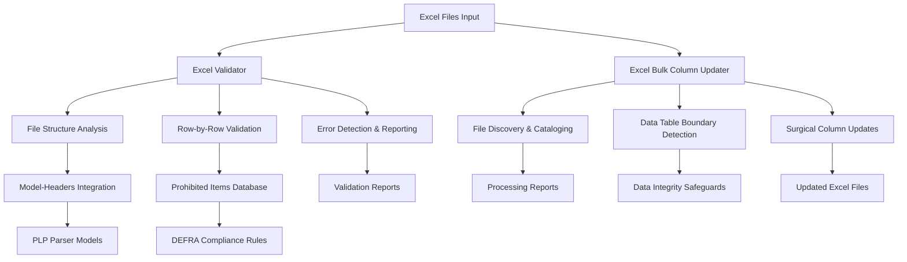

# Excel Tools - Bulk Processing and Validation Prompts

## Executive Summary

The Excel Tools provide comprehensive automation capabilities for Excel file processing, validation, and bulk operations within the Trade ExportsCore PLP project. These specialized prompts enable efficient processing of large quantities of Excel files, automated data validation against DEFRA regulations, and streamlined quality assurance workflows. The tools reduce manual Excel processing time from hours to minutes while ensuring complete data integrity and compliance with business rules.

This component serves developers, data analysts, and DevOps teams who need to process, validate, or update Excel files at scale. The tools integrate seamlessly with existing PLP parsers and validation frameworks, providing a standardized approach to Excel file management that maintains consistency across the entire packing list processing pipeline.

## Architecture Overview

The Excel Tools consist of two specialized prompts working together to provide comprehensive Excel file management:



### Integration Points

- **Parser Models**: Direct integration with `app/services/parsers/` model definitions for header detection and validation rules
- **Model Headers**: Uses `app/services/utilities/model-headers.js` for accurate column mapping and field validation
- **Prohibited Items Database**: References `app/services/data/data-prohibited-items.json` for compliance checking
- **MCP Excel Server**: Leverages MCP Excel tools for direct file manipulation without script generation
- **Business Rule Engine**: Applies DEFRA trade export regulations and validation patterns

## Features & Capabilities

### Comprehensive Excel Validation

- **Model-Based Validation**: Uses specific parser models (coop-1, tesco-1, asda-1, etc.) for accurate header detection and field validation
- **Row-by-Row Error Analysis**: Detailed validation of individual data rows with specific error reporting and column references
- **Prohibited Items Detection**: Cross-references country of origin, commodity codes, and treatment types against regulatory database
- **Business Rule Compliance**: Validates REMOS patterns, NIRMS values, and mandatory field completeness
- **Error Pattern Recognition**: Detects Excel error values (#N/A, #REF!, etc.), data type mismatches, and formatting issues

### Bulk File Processing

- **Universal File Discovery**: Comprehensive scanning and cataloging of all Excel files in specified directories
- **Surgical Column Operations**: Precise addition or updating of specific columns while preserving all existing data
- **Data Table Boundary Detection**: Intelligent identification of data ranges, excluding header rows and totals sections
- **Header and Totals Protection**: Ensures no modifications to existing column headers or aggregation rows
- **100% Processing Coverage**: Guarantees every discovered file is attempted with complete accountability reporting

### Enterprise-Grade Quality Assurance

- **Zero Code Generation**: Direct Excel operations through MCP tools without script generation or programming solutions
- **Complete Data Integrity**: Maintains existing data structures, formulas, and formatting throughout processing
- **Comprehensive Error Handling**: Graceful handling of corrupted files, access issues, and complex layouts
- **Detailed Progress Reporting**: Real-time processing updates with file-by-file outcome documentation
- **Validation Criteria Compliance**: Extensive quality gates ensuring accurate and reliable operations

## Technical Implementation

### Core Configuration

The Excel Tools are implemented as GitHub Copilot prompts with specific tool configurations:

- **Excel Validator**: Uses `tools: ['excel', 'sequential-thinking']` for comprehensive file analysis and validation reporting
- **Bulk Column Updater**: Uses `tools: ['mcp_excel_*', 'list_dir', 'file_search']` for direct Excel file manipulation
- **Model Integration**: References parser model definitions from `app/services/utilities/model-headers.js`
- **Claude 4 Sonnet Optimization**: Both prompts are optimized for enhanced Excel processing capabilities

### Validation Framework

The validation system uses a layered approach:

```yaml
PLP Model-Based Strategy:
├── Parser Model Loading → Extract specific model configuration
├── Header Detection → Use model regex patterns for column identification  
├── Field Validation → Apply model-specific validation rules
├── Business Rules → REMOS patterns, NIRMS values, prohibited items
└── Error Reporting → Row-by-row detailed error descriptions
```

### Processing Architecture

Bulk operations follow a systematic workflow:

```yaml
Processing Pipeline:
├── File Discovery → Comprehensive folder scanning and cataloging
├── Structure Analysis → Data table detection and boundary identification
├── Surgical Updates → Precise column operations within data boundaries
├── Integrity Validation → Verification of header and totals preservation
└── Comprehensive Reporting → Complete accountability for all operations
```

## Usage Guidelines

### Getting Started

1. **Select Appropriate Tool**: Choose Excel Validator for validation or Bulk Column Updater for processing
2. **Prepare Input Parameters**: Gather file paths, parser models, and processing specifications
3. **Execute with Developer Mode**: Use Developer chat mode for optimal context and tool integration
4. **Review Results**: Validate outputs and address any reported errors or issues

### Best Practices

#### Excel Validation Workflow

- **Focused Validation**: Use failure reason parameter to target specific error conditions rather than comprehensive audits
- **Model Selection**: Choose correct parser model (coop-1, tesco-1, etc.) based on file source and format
- **Error Prioritization**: Address critical errors (prohibited items, invalid REMOS) before minor formatting issues
- **Iterative Validation**: Re-validate files after making corrections to ensure error resolution

#### Bulk Processing Workflow

- **Pre-Processing Backup**: Ensure file backups exist before bulk operations (tools modify files directly)
- **Small Batch Testing**: Test column updates on small file sets before processing large batches
- **Progress Monitoring**: Review real-time progress reports to identify and address issues early
- **Result Verification**: Validate that all discovered files appear in final processing reports

### Common Workflows

#### Excel Processing Sequence
```
1. Validate file structure using "excel-validator"
2. Apply bulk updates using "excel-bulk-column-updater"  
3. Re-validate after changes to confirm error resolution
4. Generate parser if needed using parser templates
5. Create comprehensive test suite for new configurations
```

#### Quality Assurance Workflow
```
1. Run comprehensive validation with specific parser model
2. Review error reports and prioritize critical issues
3. Apply bulk corrections where applicable
4. Validate prohibited items against regulatory database
5. Confirm compliance with DEFRA trade export requirements
```

## Advanced Features

### Custom Validation Rules

The validation framework supports extensive customization:

- **Parser Model Flexibility**: Support for all existing parser models with automatic configuration loading
- **Custom Field Patterns**: Model-specific regex patterns for precise field validation and header detection
- **Business Rule Integration**: Seamless integration with DEFRA regulatory requirements and prohibited items database
- **Error Classification**: Sophisticated error categorization and severity assessment for prioritized remediation

### Bulk Processing Capabilities

Advanced processing features include:

- **Adaptive Table Detection**: Handles variable file structures, header sections, and complex layouts automatically
- **Totals Row Intelligence**: Sophisticated detection and preservation of summary rows and aggregation data
- **Hidden Sheet Filtering**: Automatic identification and exclusion of hidden or non-data sheets
- **Large File Optimization**: Efficient processing of large Excel files with thousands of rows and multiple sheets

### Integration Patterns

The tools integrate with broader PLP workflows:

- **Parser Development**: Validation tools support new parser creation by identifying required field patterns
- **Compliance Monitoring**: Regular validation workflows ensure ongoing compliance with regulatory changes
- **Data Quality Assurance**: Automated validation gates in CI/CD pipelines for quality enforcement
- **Batch Processing Operations**: Support for enterprise-scale file processing with complete auditability

## Performance Characteristics

### Processing Efficiency

The Excel Tools provide significant performance improvements over manual processes:

- **Validation Speed**: Automated validation of complex Excel files reduces review time from hours to minutes
- **Bulk Operations**: Processing multiple files simultaneously improves throughput for large-scale operations
- **Error Detection**: Comprehensive error identification eliminates manual review cycles and reduces oversight
- **Compliance Checking**: Automated prohibited items detection ensures regulatory compliance without manual cross-referencing

### Quality Improvements  

The tools enhance data quality through systematic approaches:

- **Consistency**: Standardized validation and processing patterns ensure uniform quality across all operations
- **Accuracy**: Model-based validation eliminates human error in field identification and rule application
- **Completeness**: 100% processing coverage guarantees no files are missed or inadequately processed
- **Traceability**: Detailed reporting provides complete audit trails for all validation and processing activities

## Maintenance & Evolution

### Update Procedures

Regular maintenance ensures continued effectiveness:

- **Parser Model Synchronization**: Keep validation rules aligned with parser model updates and new retailer formats
- **Regulatory Updates**: Update prohibited items database and validation rules as DEFRA regulations evolve
- **Tool Enhancement**: Refine prompts based on user feedback and new processing requirements
- **Quality Gate Validation**: Regular testing of validation accuracy and processing reliability

### Governance Processes

Structured governance ensures quality and compliance:

- **Change Management**: All prompt modifications follow established review and approval processes
- **Version Control**: Maintain clear versioning and change documentation for all prompt updates
- **User Training**: Provide updated guidance and best practices as tools evolve
- **Performance Monitoring**: Track tool effectiveness and user satisfaction for continuous improvement

### Evolution Strategy

The Excel Tools roadmap includes:

- **Enhanced Model Support**: Expand support for new parser models and retailer formats as they are developed
- **Advanced Validation**: Implement more sophisticated business rule validation and error detection capabilities
- **Integration Expansion**: Deepen integration with other PLP components and external validation systems
- **Automation Enhancement**: Develop more intelligent automation for complex Excel processing scenarios

## Related Documentation

- **[Main Prompt Library](../README.md)**: Overview of all available prompts and usage patterns
- **[Parser Templates](../parsers/README.md)**: Parser development prompts that work with validated Excel files
- **[Developer Chat Mode](../../chatmodes/README.md#developer-mode)**: Optimal chat mode for Excel tool usage
- **[Project Parser Architecture](../../../README.md)**: Main project documentation covering parser patterns and validation requirements

## Support & Contributing

### Getting Help

- **Technical Issues**: Use Developer chat mode for debugging and troubleshooting assistance
- **Process Questions**: Use DevOps chat mode for workflow guidance and integration support  
- **Validation Clarification**: Use Specifications chat mode for business rule interpretation and compliance guidance

### Contributing to Excel Tools

- **Prompt Improvements**: Submit PRs with enhanced prompts based on usage experience and learnings
- **Validation Rules**: Contribute new validation patterns and business rule implementations
- **Error Handling**: Improve error detection and reporting capabilities based on real-world usage
- **Documentation Updates**: Keep usage examples and best practices current with tool evolution

---

**Last Updated**: September 2025  
**Version**: 1.0  
**Maintainer**: DEFRA ExportsCore Team
