# DEFRA Software-Driven Development (SDD) – COO Specification Workflow

## Executive Summary

The COO (Country of Origin / Change / Capability Outcome) Specification Workflow represents a transformative approach to software development within DEFRA's trade exports ecosystem. This system enables Business Analysts and Developers to convert minimal business requirements in Azure DevOps (ADO) tickets into production-ready code through an automated, AI-assisted specification and implementation pipeline.

The workflow reduces the traditional gap between business requirements and technical implementation by providing a structured, traceable process that maintains business context while generating detailed specifications and code. This approach significantly improves delivery consistency, reduces manual transcription errors, and ensures comprehensive test coverage aligned with business acceptance criteria.

The system serves Business Analysts creating specifications, Developers implementing features, and Quality Assurance teams validating deliverables. By integrating GitHub Copilot prompt automation with Azure DevOps workflow management, the solution delivers measurable improvements in requirement clarity, implementation speed, and cross-team collaboration within the DEFRA trade exports domain.

## Architecture Overview

The COO Specification Workflow transforms minimal business requirements into production-ready code through a two-phase automated process that bridges business analysis and software development.

### High-Level Process Flow


### Detailed Technical Architecture

The COO Specification Workflow consists of two main phases working together to provide end-to-end automation from business requirements to code delivery:

```mermaid
graph TD
    %% Environment Title Nodes
    TITLE_ADO["🏢 AZURE DEVOPS ENVIRONMENT"]
    TITLE_LOCAL["💻 LOCAL DEVELOPMENT ENVIRONMENT"]
    TITLE_GITHUB["🔧 GITHUB ENVIRONMENT"]
    
    %% Step Numbers in Circles
    N1(("1"))
    N2(("2"))
    N3(("3"))
    N4(("4"))
    N5(("5"))
    N6(("6"))
    N7(("7"))
    N8(("8"))
    N9(("9"))
    N10(("10"))
    N11(("11"))
    N12(("12"))
    N13(("13"))
    
    subgraph ADO [" "]
        A["Minimal ADO Ticket"]
        C["ADO Enrichment"]
        F["Ready Status"]
        K["Spec Attachments"]
    end
    
    subgraph LOCAL [" "]
        B["COO Spec Generation"]
        D{"BA Review"}
        E["Spec Comparison"]
        G["Implementation Spec"]
        H["Test Data Updates"]
        I["Code Generation"]
        L["Local Spec Files"]
        M["Generated Code"]
        DEV_REVIEW{"Developer Review"}
        N["Unit Tests"]
    end
    
    subgraph GITHUB [" "]
        J["PR Creation"]
        PR_REVIEW{"Developer Review"}
        O["Repository"]
        Q["Prompt Files"]
    end
    
    subgraph LEGEND ["🎯 ACTOR LEGEND"]
        BA_KEY["👤 Business Analyst"]
        DEV_KEY["👤 Developer"]
        COPILOT_KEY["🤖 GitHub Copilot AI"]
    end
    
    %% Position Titles Above Subgraphs
    TITLE_ADO -.-> ADO
    TITLE_LOCAL -.-> LOCAL
    TITLE_GITHUB -.-> GITHUB
    
    %% Position Numbers with Offset to Avoid Overlap
    N1 -.-> A
    N2 -.-> B
    N3 -.-> C
    N4 -.-> D
    N5 -.-> E
    N6 -.-> F
    N7 -.-> K
    N8 -.-> G
    N9 -.-> H
    N10 -.-> I
    N11 -.-> DEV_REVIEW
    N12 -.-> J
    N13 -.-> PR_REVIEW
    
    %% Pre-Sprint Phase Flows (Steps 1-7)
    A -->|Read Ticket| B
    B -->|Execute Prompts| Q
    Q -->|Process with AI| L
    L -->|Update ADO| C
    C --> D
    D -->|Manual Edits| A
    D -->|Manual Edits| E
    D -->|Approved| F
    E -->|Compare| L
    E -->|Regenerate if needed| B
    F -->|Attach Files| K
    
    %% Sprint Execution Phase Flows (Steps 8-13)
    K -->|Download Spec| G
    G -->|Execute Prompts| Q
    Q -->|Process with AI| L
    L -->|Upload Spec| K
    G --> H
    H -->|Update Test Data| N
    H --> I
    I -->|Generate Code| M
    M -->|Review Code| DEV_REVIEW
    DEV_REVIEW -->|Approved| O
    DEV_REVIEW -->|Needs Changes| I
    O -->|Create PR| J
    J -->|Review PR| PR_REVIEW
    J -->|Link Work Item| A
    
    %% Styling by Actor
    classDef baStyle fill:#0078d4,stroke:#005a9e,stroke-width:2px,color:#fff
    classDef devStyle fill:#28a745,stroke:#1e7e34,stroke-width:2px,color:#fff
    classDef copilotStyle fill:#ff6b35,stroke:#e55a2b,stroke-width:2px,color:#fff
    classDef numberStyle fill:#ffd700,stroke:#ff8c00,stroke-width:2px,color:#000
    classDef titleStyle fill:#f8f9fa,stroke:#6c757d,stroke-width:3px,color:#212529,font-weight:bold,font-size:14px
    classDef legendStyle fill:#f8f9fa,stroke:#6c757d,stroke-width:1px,color:#212529
    
    %% BA-related components (blue)
    class BA_KEY,A,D,F baStyle
    
    %% Developer-related components (green)
    class DEV_KEY,DEV_REVIEW,PR_REVIEW devStyle
    
    %% Copilot AI-related components (orange) - now includes all technical components
    class COPILOT_KEY,B,C,E,G,H,I,J,K,L,M,N,O,Q copilotStyle
    
    class N1,N2,N3,N4,N5,N6,N7,N8,N9,N10,N11,N12,N13 numberStyle
    class TITLE_ADO,TITLE_LOCAL,TITLE_GITHUB titleStyle
    class LEGEND legendStyle
    
    class N1,N2,N3,N4,N5,N6,N7,N8,N9,N10,N11 numberStyle
    class TITLE_ADO,TITLE_LOCAL,TITLE_GITHUB titleStyle
    class LEGEND legendStyle
```



#### Process Flow Steps

**Pre-Sprint Phase (Steps 1-7):**
1. **Minimal ADO Ticket**: BA creates initial ticket with basic business context
2. **COO Spec Generation**: AI generates comprehensive specification from minimal input
3. **ADO Enrichment**: Generated content updates ticket Description and Acceptance Criteria
4. **BA Review**: Business Analyst validates and optionally edits the generated specification
5. **Spec Comparison**: (If edited) Compare local spec with ADO content for consistency
6. **Ready Status**: Mark ticket as Ready for development after approval
7. **Spec Attachments**: Attach finalized specification files to ADO ticket

**Sprint Execution Phase (Steps 8-13):**
8. **Implementation Spec**: Generate detailed technical specification for developers
9. **Test Data Updates**: Reconcile existing unit tests with specification changes
10. **Code Generation**: Generate implementation code aligned with specifications
11. **Developer Review**: Developer validates and approves the generated code
12. **PR Creation**: Create pull request with ADO work item linking for review
13. **Developer Review**: Developer reviews the pull request and approves for merge

### Integration Points
- **Azure DevOps**: Primary work item management, specification storage, and attachment repository
  - Ticket creation and status management
  - Description and Acceptance Criteria synchronization
  - Specification file attachment and version control
  - Work item linking for traceability
- **GitHub Repository**: Source code management, pull request workflow, and collaborative development
  - Code generation and version control
  - Pull request creation with ADO work item linking
  - Branch management and merge workflows
  - Code review and approval processes
- **GitHub Copilot**: AI-powered prompt execution, specification generation, and code automation
  - Prompt file execution and processing
  - Specification generation from minimal context
  - Implementation code generation
  - Test data reconciliation automation
- **Local Development Environment**: Specification processing, code development, and testing validation
  - Specification file management and editing
  - Code generation and customization
  - Unit test execution and validation
  - Development environment setup and configuration

### Technology Stack
- **Prompt Engineering**: Structured GitHub Copilot prompt files
- **Workflow Automation**: Azure DevOps integration with GitHub
- **Code Generation**: AI-assisted implementation via optimized prompts
- **Quality Assurance**: Automated test data reconciliation and validation

## Features & Capabilities

### Specification Generation
- **Automated COO Specification Creation**: Transform minimal ADO tickets into comprehensive specifications
- **Business Context Preservation**: Maintain trader-specific and regulatory requirements throughout the pipeline
- **Structured Documentation**: Generate consistent, auditable specification formats
- **Integration with Azure DevOps**: Seamless bidirectional synchronization with work item management

### Implementation Automation
- **Technical Specification Generation**: Convert business specifications into detailed implementation guides
- **Test Data Management**: Automated reconciliation of existing unit tests with specification changes
- **Code Generation**: AI-assisted implementation aligned with specification requirements
- **Traceability Maintenance**: Preserve links between business requirements and generated code

### Quality Assurance
- **Specification Validation**: Automated comparison between generated specs and manual edits
- **Test Coverage Alignment**: Ensure unit tests reflect specification scenarios and edge cases
- **Implementation Verification**: Cross-check generated code against specification requirements
- **Change Impact Analysis**: Identify and reconcile conflicts between specification updates and existing code

### Workflow Management
- **Phase-Based Process**: Clear separation between pre-sprint preparation and sprint execution
- **Role-Based Responsibilities**: Defined workflows for Business Analysts, Developers, and QA teams
- **Iteration Support**: Automated handling of specification refinement cycles
- **Status Tracking**: Integration with Azure DevOps for workflow state management

## Technical Implementation

### Prompt File Architecture
The system utilizes a structured collection of GitHub Copilot prompt files, each serving a specific function in the software development lifecycle:

#### Core Generation Prompts
- `generate-coo-spec-from-ado.prompt.md`: Primary specification generation from minimal ADO context
- `generate-implementation-from-coo-spec.prompt.md`: Technical implementation specification creation
- `implement-coo-spec.optimised.prompt.md`: Code generation aligned with specifications

#### Synchronization and Validation
- `update-ado-from-coo-spec.prompt.md`: Bidirectional synchronization with Azure DevOps
- `compare-coo-spec-with-ado.prompt.md`: Specification drift detection and resolution
- `verify-spec-implementation-from-github.prompt.md`: Implementation conformance validation

#### Test and Data Management
- `fix-existing-test-data.optimised.prompt.md`: Unit test data reconciliation and updates
- `update-coo-spec-overview-from-ado.prompt.md`: Specification index and summary generation

### Configuration and Parameters
All prompts utilize a consistent parameter pattern with the primary identifier being `ticketId` corresponding to the Azure DevOps work item ID. This ensures traceability and enables automated linking between specifications, implementations, and business requirements.

### Quality Assurance Framework
The system incorporates multiple validation layers:
- **Specification Consistency**: Automated comparison between generated and manually edited specifications
- **Test Alignment**: Validation that unit tests reflect specification scenarios
- **Implementation Verification**: Cross-checking generated code against specification requirements
- **Audit Trail**: Comprehensive logging and tracking of all generation and modification activities

## Usage Guidelines

### Getting Started

#### Prerequisites
- Access to Azure DevOps DEFRA-EXPORTSCORE-PLP project
- GitHub Copilot access with prompt file execution capabilities
- Local development environment with PLP repository cloned
- Appropriate permissions for ADO work item creation and modification

#### Basic Workflow Execution

**For Business Analysts:**
1. Create minimal ADO ticket with trader-specific business context
2. Execute COO specification generation using the ticket ID
3. Review and validate generated specification content
4. Approve specification or provide manual refinements
5. Mark ticket as Ready for development sprint planning

**For Developers:**
1. Download approved specification from ADO ticket attachments
2. Generate technical implementation specification
3. Execute test data reconciliation procedures
4. Generate implementation code aligned with specifications
5. Create pull request with appropriate ADO work item linking

### Best Practices

#### Specification Quality
- **Comprehensive Context**: Provide detailed trader and regulatory context in initial ADO tickets
- **Iterative Refinement**: Use comparison prompts to maintain consistency during manual edits
- **Documentation Attachment**: Always attach final specifications to ADO tickets for audit trail
- **Version Control**: Maintain clear versioning when specifications require multiple iterations

#### Implementation Standards
- **Specification Fidelity**: Ensure generated code aligns with approved specifications
- **Test Coverage**: Validate that updated test data covers all specification scenarios
- **Commit Hygiene**: Reference ADO work items in all commits using `AB#<ticketId>` format
- **Change Traceability**: Maintain clear links between business requirements and code changes

#### Integration Workflows
- **Parameter Consistency**: Use identical `ticketId` parameter across all related prompt executions
- **State Management**: Respect workflow phases and avoid premature progression to implementation
- **Quality Gates**: Execute validation prompts before finalizing deliverables
- **Collaboration Patterns**: Maintain clear handoffs between BA specification and developer implementation phases

### Common Workflows

#### Standard Feature Development
```bash
# BA Phase
/submit -f .github/prompts/spec/coo/generate-coo-spec-from-ado.prompt.md ticketId=591536
/submit -f .github/prompts/spec/coo/update-ado-from-coo-spec.prompt.md ticketId=591536

# Developer Phase
/submit -f .github/prompts/spec/coo/generate-implementation-from-coo-spec.prompt.md ticketId=591536
/submit -f .github/prompts/spec/coo/fix-existing-test-data.optimised.prompt.md ticketId=591536
/submit -f .github/prompts/spec/coo/implement-coo-spec.optimised.prompt.md ticketId=591536
```

#### Specification Refinement Cycle
```bash
# After manual BA edits
/submit -f .github/prompts/spec/coo/compare-coo-spec-with-ado.prompt.md ticketId=591536
# If discrepancies found, regenerate
/submit -f .github/prompts/spec/coo/generate-coo-spec-from-ado.prompt.md ticketId=591536
```

## Advanced Features

### Specification Synchronization
The workflow includes sophisticated mechanisms for maintaining consistency between locally generated specifications and manually edited Azure DevOps content. The comparison prompt identifies discrepancies and provides recommendations for resolution, ensuring that business analyst refinements are properly incorporated without losing generated specification structure.

### Test Data Reconciliation
Advanced test data management capabilities automatically identify and reconcile conflicts between existing unit test fixtures and updated specification requirements. This includes:
- **Edge Case Detection**: Identification of specification scenarios not covered by existing tests
- **Data Structure Updates**: Automatic alignment of test data with specification format changes
- **Regression Prevention**: Validation that specification changes don't break existing test scenarios

### Implementation Verification
Optional verification prompts provide automated conformance checking between generated code and specification requirements. This includes:
- **Specification Coverage**: Validation that all specification requirements are addressed in implementation
- **Pattern Compliance**: Verification that generated code follows established PLP architecture patterns
- **Integration Consistency**: Checking that new implementations align with existing system interfaces

### Extensibility Framework
The prompt system is designed for extensibility and customization:
- **Template Customization**: Modify prompt templates to align with specific trader or regulatory requirements
- **Workflow Adaptation**: Add custom validation steps or quality gates to suit team-specific processes
- **Integration Extensions**: Develop additional prompts for specialized scenarios or complex integrations

## Performance Characteristics

### Efficiency Improvements
- **Specification Generation**: Automated generation significantly reduces manual specification creation time
- **Cross-Team Alignment**: Structured workflow eliminates specification interpretation discrepancies between BA and developer teams
- **Quality Assurance**: Automated test data reconciliation reduces manual test maintenance overhead
- **Change Management**: Integrated traceability streamlines impact analysis and change tracking

### Quality Enhancements
- **Specification Consistency**: Standardized generation ensures uniform specification format and completeness
- **Implementation Accuracy**: AI-assisted code generation reduces transcription errors between specifications and code
- **Test Coverage**: Automated test data management ensures comprehensive coverage of specification scenarios
- **Audit Compliance**: Comprehensive traceability supports regulatory and quality audit requirements

### Scalability Benefits
- **Parallel Development**: Clear phase separation enables concurrent work on multiple specifications
- **Knowledge Transfer**: Standardized processes reduce dependency on individual team member expertise
- **Process Automation**: Reduced manual intervention enables handling of increased specification volume
- **Quality Standardization**: Consistent output quality regardless of team member experience level

## Maintenance & Evolution

### Update Schedules and Governance
The COO Specification Workflow documentation and prompt files follow a structured maintenance schedule aligned with the PLP project release cycle:

- **Quarterly Reviews**: Comprehensive evaluation of workflow effectiveness and prompt optimization opportunities
- **Release Alignment**: Prompt updates coordinated with major PLP system releases to ensure compatibility
- **Feedback Integration**: Regular incorporation of Business Analyst and Developer feedback for workflow refinement
- **Performance Monitoring**: Ongoing assessment of automation effectiveness and quality improvements

### Quality Assurance Procedures
- **Prompt Validation**: Systematic testing of prompt modifications against representative ADO tickets
- **Workflow Testing**: End-to-end validation of specification generation and implementation processes
- **Documentation Currency**: Regular review and update of workflow documentation and examples
- **Training Materials**: Maintenance of user guides and best practice documentation

### Evolution Strategy and Roadmap
- **AI Integration Enhancement**: Continued optimization of GitHub Copilot prompt effectiveness and accuracy
- **Process Automation**: Development of additional automation capabilities for routine workflow tasks
- **Quality Metrics**: Implementation of quantitative measures for workflow effectiveness and quality improvements
- **Stakeholder Expansion**: Extension of workflow capabilities to additional DEFRA trade export system components

## Related Documentation

### Technical Documentation
- **[PLP Architecture Guide](../../../README.md)**: Comprehensive overview of the Packing List Parser system architecture and components
- **[Parser Implementation Patterns](../../../app/services/parsers/README.md)**: Detailed guidance on retailer-specific parser development and testing
- **[Matcher Configuration Guide](../../../app/services/matchers/README.md)**: Documentation for document type detection and retailer identification
- **[Database Schema Documentation](../../../changelog/README.md)**: Database migration history and schema evolution

### Integration Guides
- **[Azure DevOps Integration](../../../docs/ado-integration.md)**: Configuration and usage patterns for ADO work item management
- **[GitHub Copilot Setup](../../../docs/copilot-setup.md)**: Installation and configuration guide for prompt automation
- **[Service Bus Configuration](../../../docs/messaging.md)**: Azure Service Bus integration for PLP message processing
- **[API Documentation](../../../docs/api-reference.md)**: REST API endpoints and integration patterns

### Process Documentation
- **[Development Workflow](../../../docs/development-workflow.md)**: Standard development practices and branch management
- **[Testing Standards](../../../docs/testing-guide.md)**: Unit testing patterns and coverage requirements
- **[Deployment Procedures](../../../docs/deployment.md)**: Environment-specific deployment and configuration management
- **[Quality Assurance Processes](../../../docs/qa-processes.md)**: Code review standards and quality gates

### Project Overview
- **[PLP Project Setup](../../../README.md)**: Getting started guide for local development environment
- **[Makefile Commands](../../../makefile)**: Available development and testing commands
- **[Environment Configuration](../../../appConfig/README.md)**: Environment-specific configuration management
- **[Docker Setup](../../../docker-compose.yaml)**: Containerized development environment setup

## Support & Contributing

### Help Resources
- **Primary Contact**: PLP Development Team
- **Documentation Issues**: Create GitHub issue with `documentation` label
- **Workflow Questions**: Contact Business Analysis team for process clarification
- **Technical Support**: Reach out to development team leads for implementation guidance

### Contribution Process
- **Prompt Modifications**: Follow established prompt engineering standards and testing procedures
- **Workflow Enhancements**: Coordinate changes with affected stakeholders and validate against existing processes
- **Documentation Updates**: Maintain consistency with enterprise documentation standards
- **Quality Standards**: Ensure all modifications maintain or improve existing quality and traceability standards

### Issue Reporting
- **Workflow Issues**: Report via Azure DevOps with component label `SDD-Workflow`
- **Prompt Problems**: Create GitHub issues with detailed reproduction steps and context
- **Documentation Errors**: Submit pull requests with corrections or create issues for larger changes
- **Process Improvements**: Engage with Business Analysis and Development leads for workflow optimization suggestions

### Contributing Guidelines
1. **Review Standards**: All contributions must align with DEFRA enterprise documentation standards
2. **Testing Requirements**: Validate prompt modifications against representative ADO tickets
3. **Change Coordination**: Coordinate workflow changes with affected teams before implementation
4. **Documentation Maintenance**: Update related documentation when modifying processes or prompts

---

## Validation Checklist

Before implementing this workflow in production, verify the following requirements are met:

### Technical Prerequisites
- [ ] Azure DevOps access configured with appropriate permissions
- [ ] GitHub Copilot enabled with prompt file execution capabilities
- [ ] Local development environment properly configured
- [ ] PLP repository cloned with current branch alignment

### Process Validation
- [ ] Business Analyst team trained on specification generation and validation procedures
- [ ] Developer team familiar with implementation specification requirements
- [ ] Quality Assurance processes aligned with automated test data management
- [ ] Stakeholder approval obtained for workflow adoption

### Quality Assurance
- [ ] All prompt files tested against representative ADO tickets
- [ ] Workflow documentation reviewed and approved by stakeholders
- [ ] Integration points validated with existing DEFRA processes
- [ ] Traceability mechanisms tested and verified functional

### Compliance Requirements
- [ ] Audit trail mechanisms validated and documented
- [ ] Regulatory compliance requirements addressed in specifications
- [ ] Data governance standards incorporated in workflow processes
- [ ] Change management procedures align with DEFRA standards

---

**Documentation Version**: 2.0  
**Last Updated**: October 2025  
**Maintained By**: PLP Development Team  
**Review Schedule**: Quarterly with major releases
