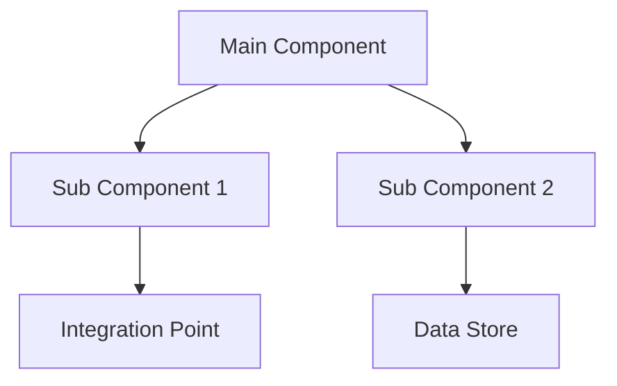

# Comprehensive README Generator

## Context

Generate high-quality README.md files for technical projects and components that serve both executive and technical audiences. The README should provide clear business value while maintaining technical depth and accuracy.

## Objective

Create comprehensive README documentation that follows established enterprise documentation standards, providing both strategic overview and implementation details without fabricated metrics or unsupported claims.

## Input Requirements

### Required Information
- **Component/Project Name**: Clear identification of what is being documented
- **Primary Purpose**: Core function and business value proposition
- **Target Audience**: Primary and secondary users (executives, developers, operations, etc.)
- **Technical Architecture**: High-level system design and component relationships
- **Key Features**: Main capabilities and functionality
- **Usage Context**: How the component fits into larger system/workflow

### Optional Information
- **Integration Points**: External systems, APIs, or dependencies
- **Performance Characteristics**: Actual measured performance (only if available)
- **Maintenance Requirements**: Update schedules, governance processes
- **Related Documentation**: Links to other relevant documentation

## Expected Output

A complete README.md file with the following structure:

### 1. Title and Executive Summary
- Clear, descriptive title
- 2-3 paragraph executive summary covering:
  - Business value and purpose
  - Key benefits and outcomes
  - Target audience and use cases
  - High-level technical approach

### 2. Architecture Overview
- System architecture diagram (Mermaid format when applicable)
- Component relationships and data flow
- Integration points and dependencies
- Technology stack and frameworks

### 3. Features & Capabilities
- Organized feature categories with clear descriptions
- Business benefits for each major capability
- Technical implementation highlights
- Integration capabilities

### 4. Technical Implementation
- Core configuration and setup information
- Architecture patterns and design decisions
- Framework and technology details
- Quality assurance and validation approaches

### 5. Usage Guidelines
- Getting started instructions
- Best practices and recommended patterns
- Common workflows and examples
- Integration procedures

### 6. Advanced Features (if applicable)
- Complex functionality and customization options
- Integration patterns and extensibility
- Performance optimization techniques
- Troubleshooting and debugging guidance

### 7. Performance Characteristics (ONLY if data available)
- **CRITICAL**: Only include actual measured metrics
- Use qualitative descriptions when quantitative data unavailable
- Focus on improvement frameworks rather than specific numbers
- Clearly distinguish between measured data and expected benefits

### 8. Maintenance & Evolution
- Update schedules and governance processes
- Quality assurance procedures
- Evolution strategy and roadmap
- Contribution guidelines

### 9. Related Documentation
- Links to detailed technical documentation
- Integration guides and API references
- Process documentation and workflows
- Project overview and setup guides

### 10. Support & Contributing
- Help resources and contact information
- Contribution processes and standards
- Issue reporting and resolution procedures

## Quality Criteria

### Content Standards
- **Accuracy**: All technical information must be verifiable and current
- **Completeness**: Cover all major aspects without overwhelming detail
- **Clarity**: Use clear, professional language appropriate for mixed audience
- **Structure**: Follow consistent formatting and organization patterns

### Technical Requirements
- **No Fabricated Metrics**: Never include performance numbers without data source
- **Mermaid Diagrams**: Use for architectural overviews when helpful
- **Markdown Standards**: Follow GitHub Markdown best practices
- **Link Validation**: Ensure all internal links are correct and functional

### Business Alignment
- **Value Focus**: Clearly articulate business benefits and outcomes
- **Audience Appropriate**: Balance executive and technical perspectives
- **Strategic Context**: Position component within broader system/goals
- **Regulatory Compliance**: Address any relevant compliance requirements

## Examples

### Executive Summary Example
```markdown
## Executive Summary

The [Component Name] provides [core business value] for the [Project Name], enabling [key business outcome]. This [technical approach] reduces [business problem] while ensuring [quality/compliance benefit]. The system serves [primary audience] and integrates seamlessly with [related systems], delivering [measurable business value] through [key technical capabilities].
```

### Architecture Overview Example
```markdown
## Architecture Overview

The [Component Name] consists of [number] main components working together to provide [core functionality]:



### Integration Points
- **[System 1]**: [integration description and purpose]
- **[System 2]**: [integration description and purpose]
- **[Service]**: [integration description and purpose]
```

### Performance Section Example (Without Fabricated Data)
```markdown
## Performance Characteristics

### Efficiency Improvements
- **[Process Name]**: Significant improvement through [technical approach]
- **[Operation]**: Streamlined workflow reduces manual effort
- **[Function]**: Automated processing improves consistency

### Quality Enhancements
- **[Aspect]**: [Technical solution] ensures [quality benefit]
- **[Process]**: Standardized approach improves [outcome]
- **[Validation]**: Automated checking reduces [problem type]
```

## Technical Considerations

### File Organization
- Place README.md in appropriate directory root
- Use relative links for internal documentation
- Organize related files in logical subdirectories
- Maintain consistent naming conventions

### Markdown Best Practices
- Use consistent heading hierarchy (## for main sections)
- Include table of contents for longer documents
- Use code blocks with appropriate language specifications
- Optimize images and diagrams for GitHub rendering

### Content Maintenance
- Include "Last Updated" and version information
- Use clear versioning strategy for documentation
- Maintain change log for significant updates
- Regular review and validation of content accuracy

### Integration with Development Process
- Update README as part of feature development
- Include documentation review in PR process
- Validate links and examples during releases
- Coordinate with related documentation updates

## Validation Checklist

Before considering the README complete, verify:

- [ ] Executive summary clearly explains business value
- [ ] Architecture overview includes visual diagram
- [ ] All technical claims are accurate and verifiable
- [ ] No fabricated performance metrics included
- [ ] Usage guidelines provide clear getting-started path
- [ ] All internal links are functional and correct
- [ ] Related documentation references are current
- [ ] Content serves both executive and technical audiences
- [ ] Formatting follows GitHub Markdown standards
- [ ] Information is complete without being overwhelming

## Usage Notes

- **Dual Audience**: Always write for both executive and technical readers
- **Evidence-Based**: Only include claims that can be substantiated
- **Living Document**: Design for ongoing maintenance and updates
- **Integration Focus**: Show how component fits into larger ecosystem
- **Quality First**: Prioritize accuracy and clarity over completeness

---

**Prompt Version**: 1.0  
**Created**: September 2025  
**Use Case**: Generate comprehensive README files following enterprise documentation standards  
**Output Format**: Complete README.md file with standardized structure
