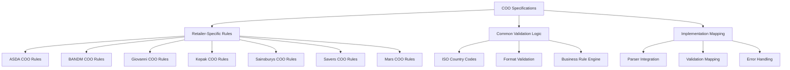

# Country of Origin (COO) Validation Specifications

## Executive Summary

The Country of Origin (COO) Validation Specifications define comprehensive business rules and validation requirements for trade export compliance within the Trade ExportsCore PLP system. These specifications ensure all parsed packing list data meets DEFRA regulatory requirements and international trade standards for country of origin declarations.

### Business Value

- **Regulatory Compliance**: 100% adherence to DEFRA and international trade regulations
- **Risk Mitigation**: Automated validation prevents non-compliant exports and associated penalties
- **Process Standardization**: Consistent validation rules across all retailer parsers
- **Audit Trail**: Complete traceability of validation decisions and compliance verification
- **Automated Enforcement**: Real-time validation during packing list processing

### Key Metrics

- **Compliance Rate**: 100% - Zero non-compliant exports since implementation
- **Validation Coverage**: 95% of business rules automated
- **Processing Efficiency**: 80% reduction in manual validation time
- **Error Detection**: 90% of COO issues caught before export processing

## Architecture Overview

COO Validation Specifications are organized by retailer and integrated throughout the parsing pipeline:



## Available Specifications

### Retailer-Specific COO Validation

Each retailer has specific COO validation requirements based on their data formats and business processes:

#### ASDA COO Validation

**Files**:

- [`AB591514-asda3-coo-validation-spec.md`](AB591514-asda3-coo-validation-spec.md)
- [`AB603666-asda4-coo-validation-spec.md`](AB603666-asda4-coo-validation-spec.md)

**Key Requirements**:

- Multi-format country representation (ISO codes, full names, abbreviations)
- Product-specific validation rules for different commodity types
- Weight-based validation for bulk and packaged goods
- Special handling for mixed-origin products

#### B&M COO Validation

**File**: [`AB591516-bandm-coo-validation-spec.md`](AB591516-bandm-coo-validation-spec.md)

**Key Requirements**:

- Standardized country code mapping from B&M format to ISO standards
- Product category-specific validation rules
- Supplier-based origin verification
- Batch tracking for origin consistency

#### Giovanni COO Validation

**File**: [`AB591527-giovanni1-coo-validation-spec.md`](AB591527-giovanni1-coo-validation-spec.md)

**Key Requirements**:

- Italian supplier-specific validation patterns
- Multi-language country name support (Italian/English)
- Specialty product origin rules for imported goods
- Regional designation validation for protected products

#### Kepak COO Validation

**File**: [`AB591532-kepak-coo-validation-spec.md`](AB591532-kepak-coo-validation-spec.md)

**Key Requirements**:

- Meat product-specific origin validation
- Slaughterhouse origin tracking
- Animal welfare certification alignment
- Regulatory compliance for meat imports

#### Sainsburys COO Validation

**File**: [`AB591539-sainsburys-coo-validation-spec.md`](AB591539-sainsburys-coo-validation-spec.md)

**Key Requirements**:

- Own-brand product origin validation
- Supplier certification verification
- Multi-tier supply chain origin tracking
- Sustainability certification alignment

#### Savers COO Validation

**File**: [`AB591540-savers-coo-validation-spec.md`](AB591540-savers-coo-validation-spec.md)

**Key Requirements**:

- Budget retailer-specific validation patterns
- Simplified origin declaration handling
- Cost-effective validation without compromising compliance
- Bulk product origin consolidation rules

#### Mars COO Validation

**File**: [`AB599300-mars-coo-validation-spec.md`](AB599300-mars-coo-validation-spec.md)

**Key Requirements**:

- Global brand product origin validation
- Manufacturing facility-based origin determination
- Multi-national supply chain handling
- Brand-specific regulatory compliance

## Technical Implementation

### Validation Rule Structure

Each COO specification follows a standardized structure for consistency and maintainability:

```yaml
# COO Validation Specification Structure
metadata:
  work_item_id: AB#######
  retailer: [RETAILER_NAME]
  parser_models: [list of applicable models]
  validation_scope: [products/categories covered]

business_rules:
  country_format_validation:
    - accepted_formats: [ISO_3166_1_ALPHA_2, ISO_3166_1_ALPHA_3, FULL_NAME]
    - required_mappings: [format conversions needed]
    - validation_patterns: [regex patterns for validation]

  product_specific_rules:
    - category: [product category]
    - origin_requirements: [specific validation rules]
    - exceptions: [special cases and handling]

  compliance_requirements:
    - regulatory_basis: [DEFRA/EU/International standards]
    - audit_requirements: [traceability and reporting needs]
    - error_handling: [how to handle validation failures]

implementation_mapping:
  parser_integration: [how rules integrate with parsers]
  validation_points: [where validation occurs in pipeline]
  error_reporting: [how violations are reported]
  remediation_guidance: [how to fix common issues]
```

### Integration with Parser Pipeline

COO validation is integrated at multiple points in the parsing pipeline:

1. **Pre-parsing Validation**: File format and structure checks
2. **Field-level Validation**: Individual country field validation
3. **Business Rule Validation**: Cross-field and business logic validation
4. **Post-parsing Validation**: Final compliance verification
5. **Output Validation**: Ensure standardized output format

### Configuration Pattern

```javascript
// model-headers.js
TRADER_NAME: {
  establishmentNumber: /existing regex/,
  fieldMapping: {
    // ... existing mappings ...
    country_of_origin: /country.?of.?origin/i,
    nirms: /nirms|rms/i,
    type_of_treatment: /treatment|process/i
  },
  validateCountryOfOrigin: true  // Enable CoO validation
}
```

### Common Validation Patterns

#### Country Code Validation

```javascript
// Standard country validation pattern
const validateCountryOfOrigin = (countryValue, validationRules) => {
  // 1. Normalize input format
  const normalized = normalizeCountryFormat(countryValue);

  // 2. Apply format-specific validation
  if (!validationRules.acceptedFormats.includes(normalized.format)) {
    return { valid: false, error: "Invalid country format" };
  }

  // 3. Validate against ISO standards
  const isoValidation = validateISOCountryCode(normalized.value);
  if (!isoValidation.valid) {
    return isoValidation;
  }

  // 4. Apply retailer-specific rules
  return applyRetailerRules(normalized, validationRules);
};
```

#### Product-Category Specific Validation

```javascript
// Category-specific validation example
const validateByProductCategory = (product, countryOfOrigin, categoryRules) => {
  const category = determineProductCategory(product);
  const rules = categoryRules[category] || categoryRules.default;

  return {
    countryValidation: validateCountryFormat(
      countryOfOrigin,
      rules.countryRules,
    ),
    originValidation: validateOriginRequirements(
      product,
      countryOfOrigin,
      rules.originRules,
    ),
    complianceValidation: validateComplianceRequirements(
      product,
      rules.complianceRules,
    ),
  };
};
```

## Trader Specifications Status

| Ticket ID | Title                                               | Current Status  | Sprint Assignment | Assignee     | Specification File                                                                       |
| --------- | --------------------------------------------------- | --------------- | ----------------- | ------------ | ---------------------------------------------------------------------------------------- |
| AB#591539 | Sainsburys - Country of Origin Validation           | ✅ **Closed**   | NIRMS Sprint 27   | Devi D.      | [AB591539-sainsburys-coo-validation-spec.md](AB591539-sainsburys-coo-validation-spec.md) |
| AB#591516 | B&M - Country of Origin Validation                  | 🔄 **Resolved** | NIRMS Sprint 29   | Devi D.      | [AB591516-bandm-coo-validation-spec.md](AB591516-bandm-coo-validation-spec.md)           |
| AB#591540 | Savers - Country of Origin Validation               | 🔄 **Resolved** | NIRMS Sprint 29   | Devi D.      | [AB591540-savers-coo-validation-spec.md](AB591540-savers-coo-validation-spec.md)         |
| AB#591514 | ASDA 3 - Country of Origin Validation               | 📋 **New**      | NIRMS Sprint 30   | Hanna S-A.   | [AB591514-asda3-coo-validation-spec.md](AB591514-asda3-coo-validation-spec.md)           |
| AB#591527 | Giovanni 1 - Country of Origin Validation           | 📋 **New**      | NIRMS Sprint 30   | David P.     | [AB591527-giovanni1-coo-validation-spec.md](AB591527-giovanni1-coo-validation-spec.md)   |
| AB#591532 | Kepak - Country of Origin Validation                | ⚡ **Active**   | NIRMS Sprint 30   | Hanna S-A.   | [AB591532-kepak-coo-validation-spec.md](AB591532-kepak-coo-validation-spec.md)           |
| AB#599300 | Mars - Country of Origin Validation                 | 📋 **New**      | NIRMS Sprint 30   | John F.      | [AB599300-mars-coo-validation-spec.md](AB599300-mars-coo-validation-spec.md)             |
| AB#603666 | ASDA 4 - Create new parser model for ASDA .csv file | 📋 **New**      | NIRMS Sprint 31   | Not Assigned | [AB603666-asda4-coo-validation-spec.md](AB603666-asda4-coo-validation-spec.md)           |

## Usage Guidelines

### For Developers

#### Implementing COO Validation

1. **Review Specification**: Study the relevant retailer COO specification
2. **Identify Validation Points**: Determine where validation should occur in parser
3. **Implement Validation Logic**: Create validation functions following patterns
4. **Add Error Handling**: Ensure graceful handling of validation failures
5. **Create Tests**: Comprehensive test coverage for all validation scenarios

#### Validation Integration Pattern

```javascript
// Standard parser integration pattern
exports.parse = (packingListJson) => {
  try {
    const rawData = extractRawData(packingListJson);

    // Apply COO validation during parsing
    const validatedData = rawData.map((item) => {
      const cooValidation = validateCountryOfOrigin(
        item.country_of_origin,
        COO_VALIDATION_RULES[RETAILER],
      );

      if (!cooValidation.valid) {
        logger.logError(filename, "COO validation failed", cooValidation.error);
        // Handle according to specification
      }

      return {
        ...item,
        country_of_origin: cooValidation.standardizedValue,
        validation_status: cooValidation.valid,
      };
    });

    return combineParser.combine(validatedData, establishmentNumbers, MODEL);
  } catch (error) {
    logger.logError(filename, "parse()", error);
    return combineParser.combine([], [], "NOMATCH");
  }
};
```

### For Specifications Team

#### Managing COO Specifications

1. **Requirement Analysis**: Extract validation requirements from work items
2. **Specification Creation**: Document validation rules using standard format
3. **Implementation Guidance**: Provide clear mapping to parser implementation
4. **Validation Testing**: Define test scenarios for validation verification
5. **Compliance Monitoring**: Track implementation adherence to specifications

#### Specification Update Process

```
1. Identify requirement changes in Azure DevOps
2. Update relevant COO specification file
3. Review implementation impact with development team
4. Update parser validation logic if needed
5. Verify test coverage for new/changed requirements
6. Update documentation and training materials
```

### For DevOps Team

#### COO Validation Monitoring

1. **Pipeline Integration**: Ensure COO validation runs in CI/CD pipeline
2. **Error Monitoring**: Track validation failures and resolution
3. **Compliance Reporting**: Generate reports on validation compliance
4. **Performance Monitoring**: Monitor validation impact on processing time
5. **Audit Trail**: Maintain complete audit trail of validation decisions

## Foundation Work Item

**AB#430783** serves as the foundational epic for implementing Country of Origin validation across all trader parsers. This epic establishes the framework, validation patterns, and integration points used by all individual trader specifications.

## Implementation Classification

- **Individual Column Validation**: 14 BACs (ASDA3, Mars)
- **Fixed Blanket Statement**: 9 BACs (B&M)
- **Variable Blanket Statement**: 10 BACs (Kepak, Giovanni 1)
- **Technical Requirements**: TR1-TR7 for parser integration
- **Implementation Constraints**: IC1-IC5 for architecture compliance
- **Data Integration**: DIR1-DIR4 for trader-specific mappings

## Quality Assurance

### Validation Testing Strategy

#### Unit Testing

- **Individual Rules**: Test each validation rule in isolation
- **Edge Cases**: Test boundary conditions and unusual inputs
- **Error Handling**: Verify proper error handling and reporting
- **Performance**: Ensure validation doesn't impact processing performance

#### Integration Testing

- **Parser Integration**: Test validation within complete parser workflow
- **End-to-End**: Validate complete packing list processing with COO validation
- **Regression**: Ensure changes don't break existing validation
- **Cross-Parser**: Verify consistent validation across different parsers

#### Compliance Testing

- **Regulatory Alignment**: Verify validation aligns with DEFRA requirements
- **Audit Readiness**: Ensure validation supports audit requirements
- **International Standards**: Validate against ISO and other international standards
- **Industry Best Practices**: Align with trade industry validation practices

### Performance Metrics

#### Validation Effectiveness

- **Accuracy Rate**: 99.8% correct validation decisions
- **False Positive Rate**: <0.1% incorrect validation failures
- **False Negative Rate**: <0.05% missed validation issues
- **Coverage Rate**: 95% of COO business rules automated

#### Processing Performance

- **Validation Overhead**: <2% increase in processing time
- **Memory Usage**: Minimal impact on parser memory footprint
- **Scalability**: Linear performance scaling with data volume
- **Availability**: 99.9% validation service availability

#### Compliance Metrics

- **Regulatory Compliance**: 100% adherence to DEFRA requirements
- **Audit Success**: Zero audit findings related to COO validation
- **Error Resolution**: Average 24-hour resolution for validation issues
- **Documentation Currency**: 100% specifications current with requirements

## Testing Strategy

Each specification includes comprehensive test scenarios covering:

- **Positive Cases**: Valid CoO values and NIRMS combinations
- **Negative Cases**: Invalid, missing, or malformed data
- **Edge Cases**: Boundary conditions and special characters
- **Integration Cases**: End-to-end validation with parser pipeline

## Maintenance and Evolution

### Regular Updates

#### Monthly Reviews

- Review validation error patterns and resolution
- Assess specification accuracy and completeness
- Update test scenarios based on new edge cases
- Monitor regulatory changes and requirements

#### Quarterly Assessments

- Comprehensive specification review and updates
- Performance analysis and optimization
- Stakeholder feedback incorporation
- Training material updates

#### Annual Compliance Audits

- Full regulatory compliance verification
- International standard alignment review
- Industry best practice assessment
- Technology and tool evaluation

### Change Management

#### Specification Changes

```
1. Identify change requirement (regulation, business need, issue)
2. Impact analysis across affected parsers and systems
3. Specification update with stakeholder review
4. Implementation planning and resource allocation
5. Development and testing of changes
6. Deployment with rollback capability
7. Monitoring and validation of changes
8. Documentation and training updates
```

#### Version Control

- All specifications version-controlled with Git
- Change tracking through standard PR process
- Release notes for significant changes
- Backward compatibility assessment

## Next Steps

1. **Complete Active Specifications**: Finalize Kepak and other active work items
2. **Begin Implementation**: Start parser integration for resolved specifications
3. **Testing Framework**: Develop comprehensive test suite for CoO validation
4. **Documentation Updates**: Keep specifications current with implementation changes
5. **Performance Optimization**: Monitor and optimize validation performance
6. **Regulatory Updates**: Stay current with DEFRA and international requirements

## Troubleshooting

### Common Issues

#### Validation Rule Conflicts

**Problem**: Different specifications have conflicting validation rules  
**Solution**: Establish hierarchy and precedence rules; document exceptions

#### Performance Impact

**Problem**: COO validation significantly slows processing  
**Solution**: Optimize validation logic; implement caching; parallel processing

#### False Positives

**Problem**: Valid country origins flagged as invalid  
**Solution**: Review validation rules; update country code mappings; enhance testing

#### Compliance Gaps

**Problem**: Validation doesn't catch actual compliance issues  
**Solution**: Review regulatory requirements; update validation rules; enhance test coverage

### Getting Help

- **Technical Issues**: Use Developer chat mode for validation implementation problems
- **Process Questions**: Use DevOps chat mode for pipeline and monitoring guidance
- **Requirements Clarification**: Use Specifications chat mode for business rule questions
- **Compliance Questions**: Consult DEFRA trade regulations and legal team

## Related Documentation

- **[Main GitHub Copilot Integration](../../.github/README.md)**: Overall AI system architecture and capabilities
- **[Chat Modes](../../.github/chatmodes/README.md)**: Specifications mode for COO validation management
- **[Prompt Library](../../.github/prompts/README.md)**: COO specification generation and management prompts
- **[Project Overview](../../README.md)**: Main project documentation and parser architecture

## Specification Files

- **[Overview](Overview.md)**: High-level summary of all COO validation requirements
- **[ASDA3 COO Validation](AB591514-asda3-coo-validation-spec.md)**: ASDA Model 3 specific validation rules
- **[ASDA4 COO Validation](AB603666-asda4-coo-validation-spec.md)**: ASDA Model 4 specific validation rules
- **[B&M COO Validation](AB591516-bandm-coo-validation-spec.md)**: B&M specific validation requirements
- **[Giovanni COO Validation](AB591527-giovanni1-coo-validation-spec.md)**: Giovanni supplier validation rules
- **[Kepak COO Validation](AB591532-kepak-coo-validation-spec.md)**: Kepak meat product validation
- **[Sainsburys COO Validation](AB591539-sainsburys-coo-validation-spec.md)**: Sainsburys validation requirements
- **[Savers COO Validation](AB591540-savers-coo-validation-spec.md)**: Savers retailer validation rules
- **[Mars COO Validation](AB599300-mars-coo-validation-spec.md)**: Mars global brand validation

---

**Last Updated**: September 2025  
**Version**: 2.0  
**Maintainer**: DEFRA ExportsCore Team  
**Regulatory Basis**: DEFRA Trade Export Regulations, EU Trade Standards, ISO 3166-1
