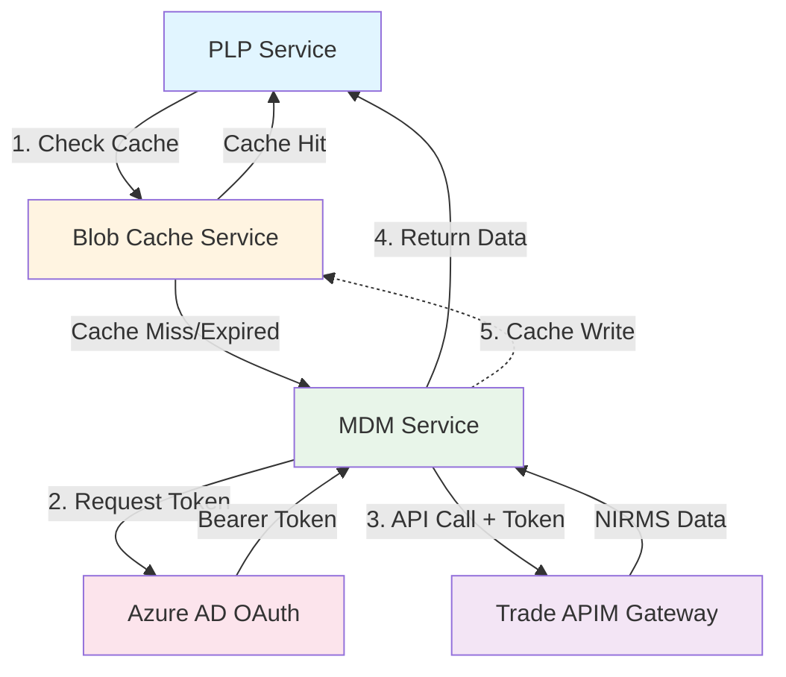
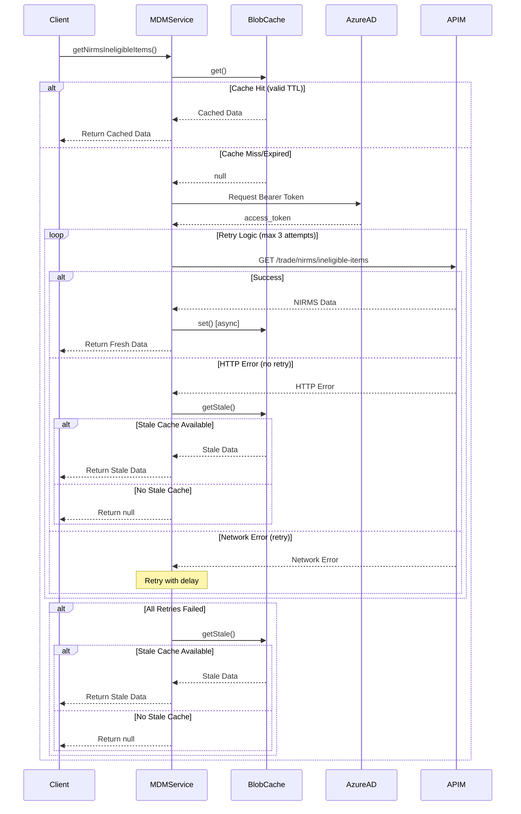
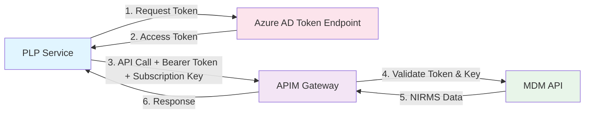

# MDM API Integration

## Overview

This integration enables the PLP service to connect to the MDM (Master Data Management) API through the Trade APIM endpoint to retrieve NIRMS (Northern Ireland Retail Movement Scheme) ineligible items data.

## Implementation Summary

### Files Created/Modified

#### New Files:

1. **`app/config/mdm-config.js`** - MDM API configuration
2. **`app/services/mdm-service.js`** - Service for interacting with MDM API
3. **`app/routes/test-mdm-conn.js`** - Test endpoint for MDM connectivity
4. **`test/unit/config/mdm-config.test.js`** - Config unit tests
5. **`test/unit/services/mdm-service.test.js`** - Service unit tests (12 tests)

#### Modified Files:

1. **`app/config/index.js`** - Added mdmConfig export
2. **`app/plugins/router.js`** - Registered test-mdm-conn route
3. **`appConfig/appConfig.yaml`** - Added MDM_API_URL and MDM_SUBSCRIPTION_KEY
4. **`test/unit/plugins/router.test.js`** - Updated router tests

### Configuration

**Environment Variables:**

```yaml
MDM_API_URL: "{{servicename}}-MDM-API-URL"
MDM_SUBSCRIPTION_KEY: "{{servicename}}-MDM-SUBSCRIPTION-KEY"
MDM_TENANT: "{{servicename}}-MDM-TENANT"
MDM_AUTH_URL: "{{servicename}}-MDM-AUTH-URL"
MDM_CLIENT_ID: "{{servicename}}-MDM-CLIENT-ID"
MDM_CLIENT_SECRET: "{{servicename}}-MDM-CLIENT-SECRET"
MDM_SCOPE: "{{servicename}}-MDM-SCOPE"
```

**Example Values (TST environment):**

- API URL: `https://tst-internal-gateway.trade.azure.defra.cloud/mdm`
- Auth URL: `https://login.microsoftonline.com/{tenant}/oauth2/v2.0/token`
- Scope: `api://tst-futuretrade-int.defra.gov.uk/.default`

### API Endpoint

**Test Endpoint:** `GET /test-mdm-conn`

- Returns NIRMS ineligible items data from MDM API
- Returns 200 OK on success with JSON data
- Returns 503 Service Unavailable on failure

### Service Features

The `mdm-service.js` includes:

- **Retry Logic**: Automatically retries failed requests (default: 3 attempts with 2s delay)
- **Error Handling**: Comprehensive error logging and graceful degradation
- **Network Resilience**: Only retries on network errors, not HTTP errors
- **Logging**: Detailed info and error logging throughout

### Usage Example

```javascript
const { getNirmsIneligibleItems } = require("./app/services/mdm-service");

// Get NIRMS data from MDM API
const data = await getNirmsIneligibleItems();

if (data) {
  // Process the ineligible items data
  console.log("Retrieved NIRMS data:", data);
} else {
  // Handle error case
  console.error("Failed to retrieve NIRMS data");
}

// Custom retry parameters
const dataWithCustomRetry = await getNirmsIneligibleItems(5, 3000); // 5 retries, 3s delay
```

### Architecture

**Matcher-Parser Pipeline Integration:**

The MDM service integrates into the existing PLP architecture to provide ineligible items validation during packing list processing. The service is called during the validation phase to check if commodity codes are ineligible.



## Blob Cache Implementation

### Overview

The MDM blob cache provides a distributed caching layer for NIRMS ineligible items data using Azure Blob Storage. This reduces API calls to the MDM service and improves response times for frequently accessed data.

### Configuration

**Container Name:** `mdm-cache` (configurable via `MDM_CACHE_CONTAINER`)  
**Blob Name:** `nirms-ineligible-items.json`  
**TTL:** Configurable via `MDM_CACHE_TTL_SECONDS` (default: 3600 seconds / 1 hour)  
**Authentication:** DefaultAzureCredential (Managed Identity in Azure, Service Principal locally)

### Cache Flow

1. **Cache Check**: On API request, check blob storage for cached data
2. **TTL Validation**: Compare blob's `lastModified` timestamp against configured TTL
3. **Cache Hit**: Return cached data if valid, skip API call
4. **Cache Miss/Expired**: Fetch from MDM API
5. **Cache Write**: Asynchronously cache successful API response (fire-and-forget)



### Blob Storage Cache

- **Pros**: Persistent storage, survives restarts, good for infrequent changes
- **Use Case**: Production environments with managed identity, data persistence requirements
- **Authentication**: DefaultAzureCredential (Managed Identity in Azure, Service Principal locally)
- **TTL Enforcement**: Manual checking via blob lastModified timestamp comparison

### Graceful Degradation

- Cache disabled: Service operates normally without caching
- Cache read failure: Falls back to API fetch, logs error
- Cache write failure: Returns API data successfully, logs error
- Missing storage: Service continues with API-only mode

### Environment Variables

| Variable                     | Description                   | Default     | Type    |
| ---------------------------- | ----------------------------- | ----------- | ------- |
| `MDM_CACHE_ENABLED`          | Enable/disable caching        | `true`      | Boolean |
| `MDM_CACHE_TTL_SECONDS`      | Cache time-to-live in seconds | `3600`      | Integer |
| `MDM_CACHE_CONTAINER`        | Blob storage container name   | `mdm-cache` | String  |
| `AZURE_STORAGE_ACCOUNT_NAME` | Azure Storage account name    | -           | String  |

### Manual Cache Invalidation

**Endpoint:** `DELETE /mdm/cache`

**Response:**

```json
{
  "success": true,
  "message": "MDM cache successfully invalidated"
}
```

**Error Response:**

```json
{
  "success": false,
  "error": "Error message"
}
```

**Usage:**

```bash
curl -X DELETE http://localhost:3000/mdm/cache
```

### Monitoring

- All cache operations logged via standard PLP logger
- Cache hits/misses tracked in logs
- TTL validation details logged for troubleshooting
- Cache write failures logged but don't impact API response

### Authentication

Configured with **OAuth 2.0 Client Credentials + APIM Subscription Key**:

- **OAuth Flow**: Client credentials grant type
- **Bearer Token**: Retrieved from Azure AD token endpoint before each API call
- **APIM Header**: `Ocp-Apim-Subscription-Key` required for APIM gateway
- **Token Scope**: Application-specific scope for Future Trade API



### Testing

**Run MDM tests:**

```bash
npm test -- --testPathPattern="mdm"
```

**Test connectivity:**

```bash
# Start the service
npm start

# Test the endpoint
curl http://localhost:3000/test-mdm-conn
```

### API Endpoint Details

**Full API Path:**

```
{MDM_API_URL}/trade/nirms/ineligible-items
```

### Network Requirements

- Service must have network connectivity to the internal gateway endpoint
- Internal gateway endpoint requires VNet access or proper network configuration
- Ensure DNS resolution is configured correctly
- OAuth token endpoint must be accessible (login.microsoftonline.com)

### Future Enhancements

1. **Token Caching**: Cache OAuth bearer tokens until expiry to reduce token requests
2. **Data Transformation**: Map MDM response to existing ineligible items format
3. **Fallback**: Implement fallback to local JSON files if API unavailable
4. **Environment-specific URLs**: Configure per-environment values in appConfig files (dev1, tst1, snd4, pre1, prd1)

### Test Coverage

- ✅ 12 unit tests covering all scenarios
- ✅ Success on first attempt
- ✅ Success after retries with logging
- ✅ HTTP error handling (401, 404, 500)
- ✅ Network error retry logic
- ✅ Maximum retry limit
- ✅ Custom retry parameters
- ✅ Configuration tests

All tests passing with full coverage of the MDM service logic.
